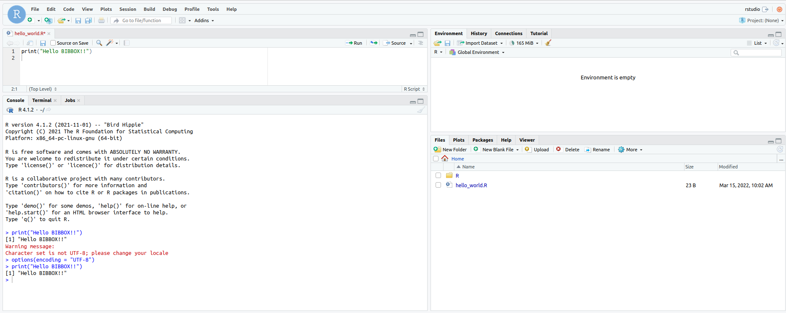

## RStudio Server Installation Instructions 

### Start RStudio

Be patient this can take some time.

When opening you should see a login page. Username and password can be set during the installation in BIBBOX (defauft: rstudio/rstudio):

#### Start Scripting
After you logged in you see the normal Rstudio environment

### Add new User

Open the shell in the docker:

`docker exec -it <instance_id>-rstudio bash`

Now you can add a user via:

`useradd -ms /bin/bash "<new_username>"`

`passwd "<new_username>"`

done.

## After the installation
Have a nice ride with the Admins youngtimer.

