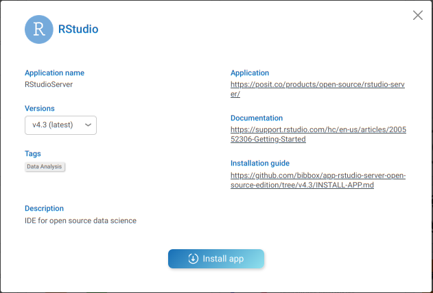
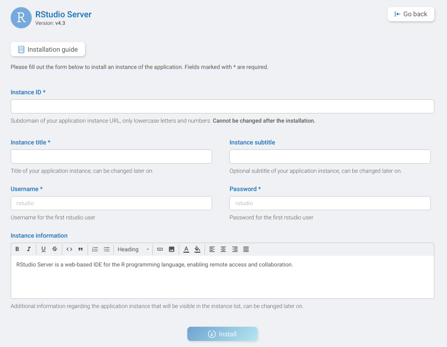

## RStudio Server Installation Instructions 

The application can be installed either within the BIBBOX environment or as a stand-alone solution. Installation instructions can be found within the BIBBOX, followed by setup instructions required once the application has been successfully installed.

## Installation within in the BIBBOX

Once you've selected the desired App for your BIBBOX instance, you can choose from the available versions, as shown in the following figure.

Clicking "Install App" will open a new window, as illustrated in the following figure. Here, you can define the necessary entries. Some fields come pre-filled with suggested options, and if left unchanged, these default values will be used as the entries.

After confirming by clicking "Install," the App will be installed as a BIBBOX instance. Once the installation is complete, you only need to follow a few steps to use the App for the first time, which are described below.

### Start RStudio

Be patient this can take some time.

When opening you should see a login page. Username and password can be set during the installation in BIBBOX (defauft: rstudio/rstudio):

#### Start Scripting
After you logged in you see the normal RStudio environment

### Add new User

Open the shell in the docker:

`docker exec -it <instance_id>-rstudio bash`

Now you can add a user via:

`useradd -ms /bin/bash "<new_username>"`

`passwd "<new_username>"`

done.

## After the installation
Have a nice ride with the Admins youngtimer.

